# SentinelX Architectural Specification & System Diagrams

SentinelX is an event-driven, resilient distributed emergency response platform. This document specifies the comprehensive system architecture using 12 concrete Mermaid diagrams.

---

## 1. System Architecture Overview

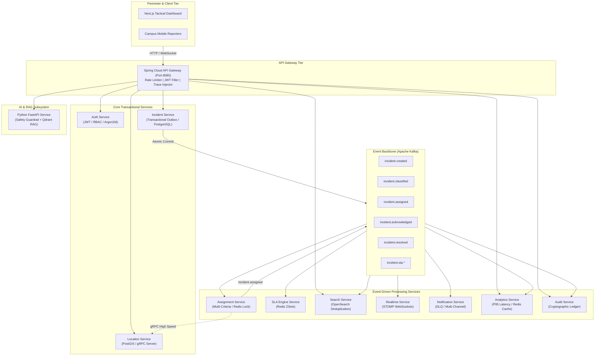

---

## 2. Incident Lifecycle State Machine

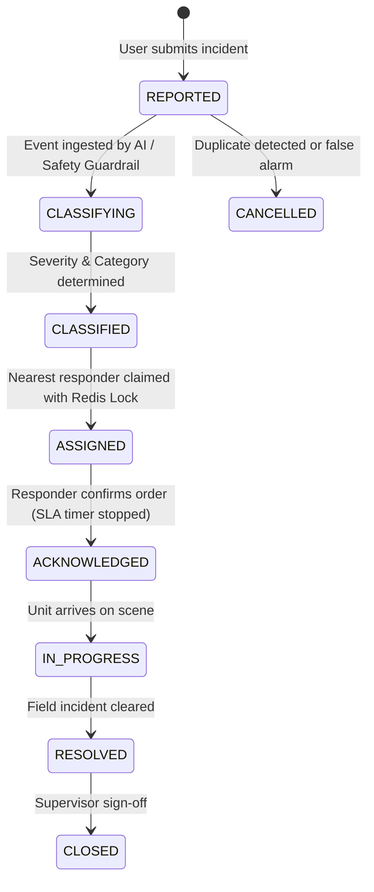

---

## 3. Kafka Event Architecture & Partitioning

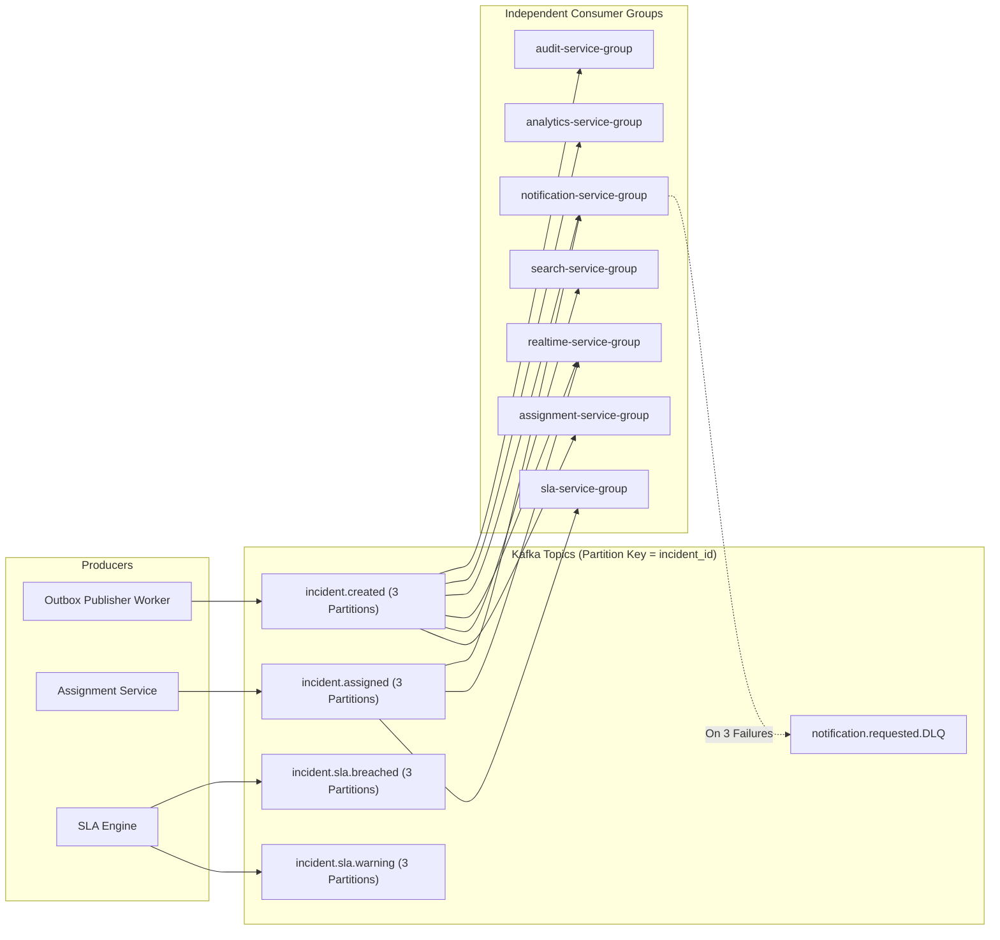

---

## 4. Database Architecture (Database-Per-Service)

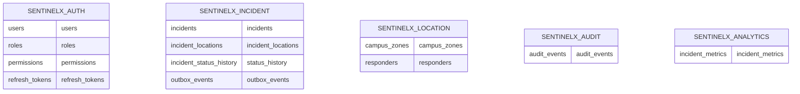

---

## 5. AI Classification Pipeline & Deterministic Safety Override

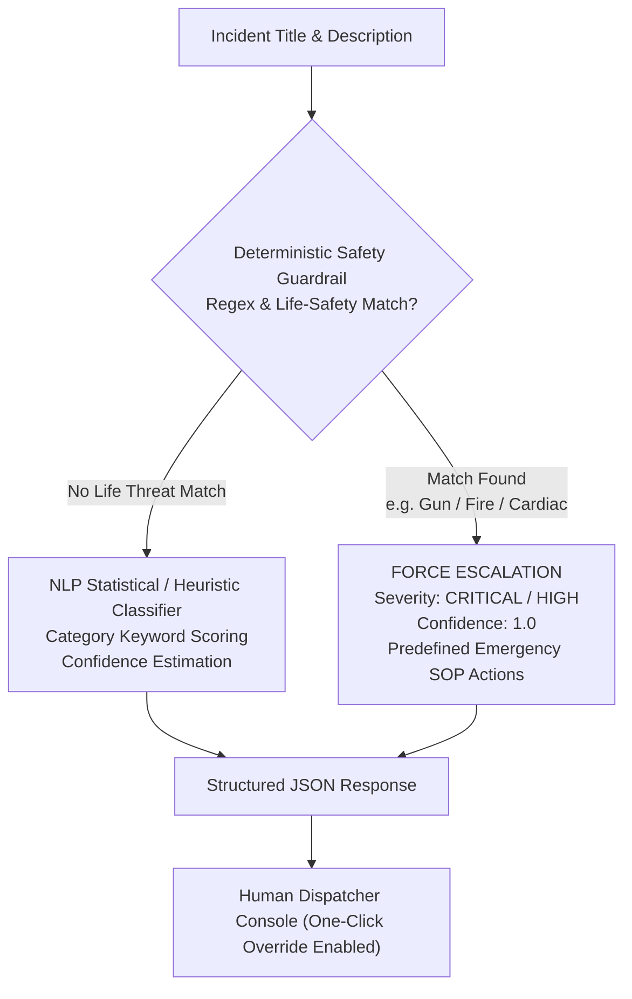

---

## 6. Grounded RAG Emergency Procedure Pipeline

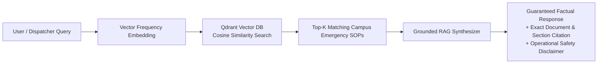

---

## 7. Deployment Architecture (Kubernetes)

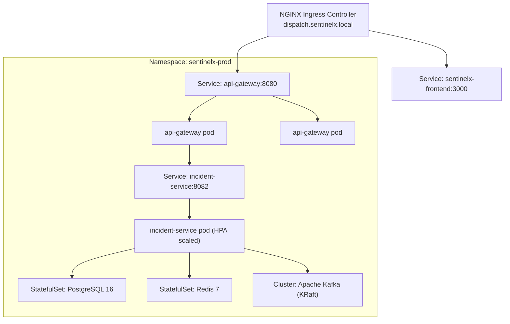

---

## 8. Distributed Tracing Flow

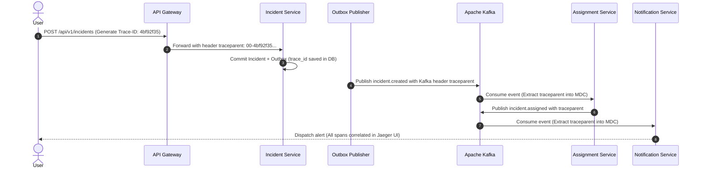

---

## 9. Failure & Recovery Flow (Outbox & DLQ)

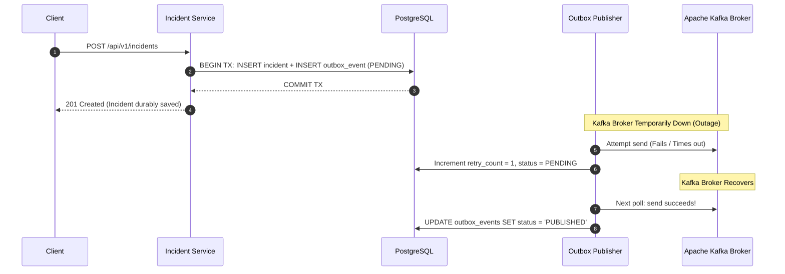

---

## 10. Authentication & Token Rotation Flow

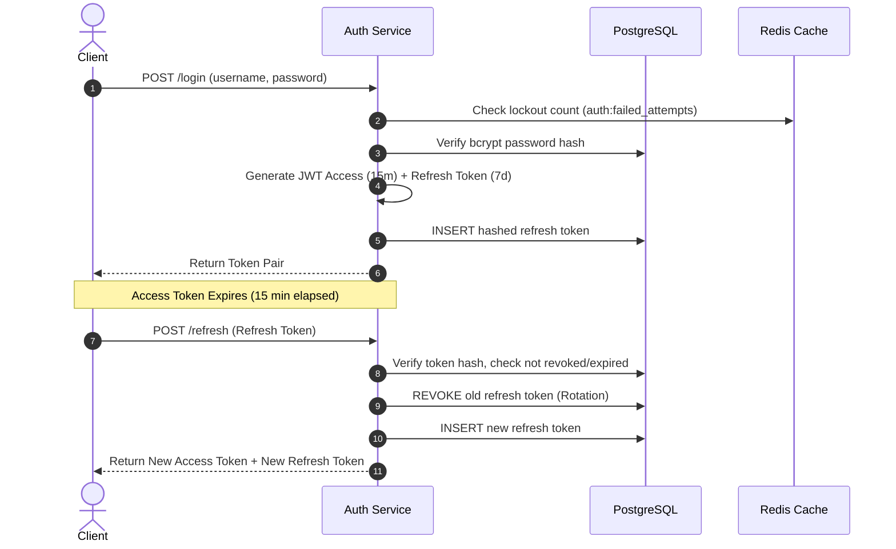

---

## 11. Multi-Criteria Assignment Algorithm Flow

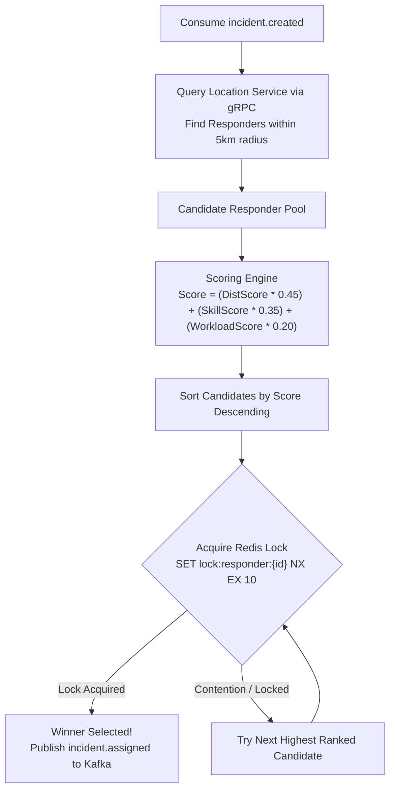

---

## 12. SLA Engine Architecture (Redis Sorted Sets)

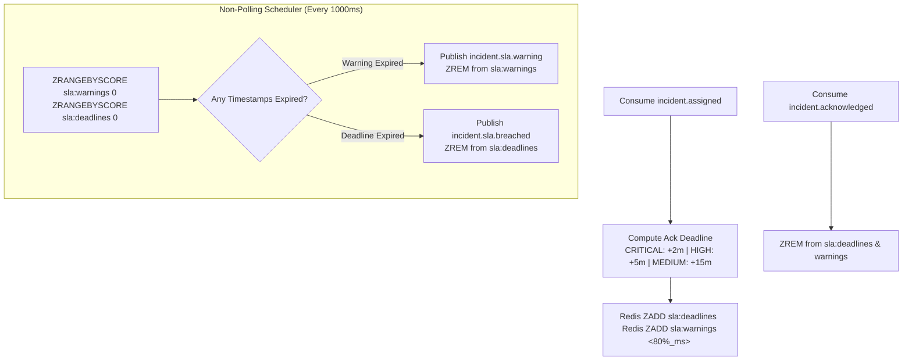
